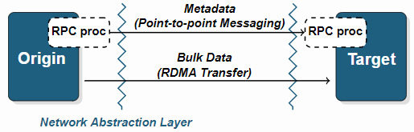

# Mercury Documentation

文档反映了Mercury从v1.0.1开始的API，可以用作Mercury库的简介。请查看[see also](https://mercury-hpc.github.io/documentation/#see-also)部分以获取其他文档。

## Overview

Mercury由三个主要层组成：

1. 网络抽象层，它在较低级别的网络结构fabrics之上提供高性能的通信接口。
2. RPC层，该层为用户提供了用于发送和接收RPC元数据（小消息）的必要组件。这包括函数参数的序列化和反序列化；
3. 批量层，提供处理大参数的必要组件-这意味着通过RMA进行大数据传输；
4. （可选的）高级RPC层旨在提供一个便捷的API，它在较低的层之上构建，并提供用于生成RPC存根以及序列化和反序列化功能的宏。

下图总结了这三个主要层：



根据定义，RPC调用由一个进程（称为origin）发起，并转发到另一个进程，该进程将执行该调用，并称为target。双方（origin和target）都使用RPC处理器对通过接口发送的参数进行序列化和反序列化。以相对较小的参数调用函数会导致使用网络抽象层公开的**短消息传递机制**，而包含较大数据参数的函数还使用**远程内存访问（RMA）机制**。

## 网络抽象层

RPC层和批量层在内部都使用**网络抽象（NA）层**（因此，普通mercury用户不希望直接使用它，请参阅RPC层部分）。网络抽象（NA）层提供了一组最少的函数调用，这些函数抽象了基础网络结构fabric，可用于提供以下功能：target地址查找、具有非预期和预期消息传递的点对点消息传递、远程内存访问、进度和取消。该API是非阻塞的，并使用**回调机制**，以便高层可以更轻松地提供异步执行：取得进展（在内部或在调用`NA_Progress()`之后）并且操作完成时，用户回调将放置在**完成队列**。然后，可以在调用`NA_Trigger()`之后使该回调出队并分别执行。

NA层使用**插件机制**，因此可以在运行时轻松添加和选择对各种网络协议的支持。

### NA接口

通常，**第一步**包括初始化NA接口并选择将要使用的基础插件。可以在NA级别或HG级别（请参阅RPC层部分）完成此操作。使用指定的`info_string`初始化NA接口会导致创建新的`na_class_t`对象。请参阅[可用的插件章节](https://mercury-hpc.github.io/documentation/#available-plugins)，以获取有关`info_string`格式的更多信息。另外，可以指定`na_class_t`对象是否在侦听（用于传入连接）——**这是唯一定义“服务器”特定行为的时间**，所有后续调用在“客户端”和“服务器”之间没有任何区别，相反只是使用`origin`和`target`两个概念。

```c
na_class_t *NA_Initialize(const char *info_string, na_bool_t listen);
```

如果需要更特定的行为，则可以使用以下调用来传递特定的init选项。

```c
struct na_init_info {
    na_progress_mode_t progress_mode;   /* Progress mode */
    na_uint8_t max_contexts;            /* Max contexts */
    const char *auth_key;               /* Authorization key */
};

na_class_t *NA_Initialize_opt(const char *info_string, na_bool_t listen,
    const struct na_init_info *na_init_info);
```

使用`NA_NO_BLOCK`设置**进度模式（progress mode）**时，会在进行进度（making progress）而不是释放CPU时，进行显式忙于旋转（busy spinning）的请求。现在，“最大上下文数”选项特定于libfabric/OFI插件和可伸缩端点（有关更多详细信息，请参见[进度模式](https://mercury-hpc.github.io/documentation/2018/10/22/progress-modes.html)部分）。授权密钥允许将特定于系统的凭据向下传递到插件，这在Cray®系统上是必需的，以启用单独作业之间的通信（有关更多详细信息，请参阅[DRC凭据](https://mercury-hpc.github.io/documentation/2018/10/22/drc-credentials.html)部分）。

通过这些初始化调用创建的`na_class_t`对象可以稍后在调用以下命令后释放：

```c
na_return_t NA_Finalize(na_class_t *na_class);
```

接口初始化后，必须在此插件内创建一个上下文，该上下文在内部创建并关联操作的完成队列：

```c
na_context_t *NA_Context_create(na_class_t *na_class);
```

然后可以使用以下方法销毁它：

```c
na_return_t NA_Context_destroy(na_class_t *na_class, na_context_t *context);
```

要连接到目标并开始通信，首先必须获取目标的地址。最方便、最安全的方法是首先在目标上调用（或等效的`HG_Addr_xxx()`函数调用）：

```c
na_return_t NA_Addr_self(na_class_t *na_class, na_addr_t *addr);
```

然后使用以下命令将该地址转换为字符串：

```c
na_return_t NA_Addr_to_string(na_class_t *na_class, char *buf,
                              na_size_t buf_size, na_addr_t addr);
```

然后可以通过带外out-of-band机制（例如使用文件）将该字符串传递给其他进程，然后可以使用非阻塞函数查找`目标`：

```c
typedef na_return_t (*na_cb_t)(const struct na_cb_info *callback_info);

na_return_t NA_Addr_lookup(na_class_t *na_class, na_context_t *context,
                           na_cb_t callback, void *arg, const char *name,
                           na_op_id_t *op_id);
```

此函数接受一个用户回调函数。在这种情况下，需要调用`NA_Progress()`和`NA_Trigger()`，并且在执行用户回调时可以检索得到地址。然后必须使用以下方法释放所有地址：

```c
na_return_t NA_Addr_free(na_class_t *na_class, na_addr_t addr);
```

其他例程例如`NA_Msg_send_unexpected()`，`NA_Msg_send_expected()`，`NA_Msg_recv_unexpected()`，`NA_Msg_recv_expected()`，`NA_Put()`，`NA_Get()`等在内部使用,不需要直接使用它们。

### 可用的插件

#### BMI

BMI库本身不再需要进行除基本维护以外的主动功能开发，但与BMI的TCP方法一起使用时，BMI Mercury NA插件为IP网络提供了非常稳定且性能合理的选项。

*技术说明：*

- 低CPU占用率（例如，直接闲置而没有忙碌的旋转或使用线程）。
- 支持动态客户端连接和断开连接。
- RMA（用于Mercury批量操作）是通过点对点消息传递进行仿真的。
- 不支持同时初始化多个实例。
- 不支持TCP以外的其他BMI方法。
- 有关BMI的一般信息，请参见本[论文](http://ieeexplore.ieee.org/abstract/document/1420118/)。

#### MPI

MPI实施几乎可以在所有平台上使用，并且MPI Mercury NA插件为原型设计和功能测试提供了一个方便的选择。但是，它并未针对性能进行优化，并且在用于持久性服务时存在一些实际限制。

*技术说明：*

- 仅当基础MPI实现支持`MPI_Comm_connect()`时，客户端才能动态连接到服务器。
- RMA（用于Mercury批量操作）通过点对点消息传递进行仿真（注意：创建MPI窗口需要集体协调，因此不适合RPC使用）。
- 大量的CPU消耗（进度函数反复轮询待完成的操作以完成操作）。

#### SM

（自v0.9.0起）这是Mercury随附的集成共享内存NA插件。插件是稳定的，并且为**本地节点通信**提供了明显更好的性能。
此插件的最终目标是在其他NA插件使用`auto_sm`初始化选项连接到本地服务时为它们提供透明的快捷方式（有关更多详细信息，请参阅[共享内存](https://mercury-hpc.github.io/documentation/2018/10/29/shared-memory.html)部分），但它也可以用作单插件的主要传输方式
节点服务。

([更多...](https://mercury-hpc.github.io/documentation/#available-plugins))

## RPC Layer

RPC层为用户提供了用于发送、接收和执行RPC的必要组件。该层由两个子层组成：**HG核心RPC层**，它将RPC操作定义为缓冲区，该缓冲区被发送到目标并触发与该操作相关的回调；**HG RPC层**，包括函数参数的序列化和反序列化。

每个RPC调用都会将函数参数序列化到内存缓冲区中（根据所使用的网络协议，其大小通常限制为几千字节）。然后，使用网络抽象（NA）层接口将此缓冲区发送到目标。关键要求之一是在传输的任何阶段都**限制存储副本**，尤其是在传输大量数据时。因此，如果发送的数据很小，则使用**小消息**（非预期消息和预期消息，unexpected and expected messages）对它进行序列化和发送。否则，将在同一条小消息内将**要传输的存储区域的描述**发送到目标，**然后目标可以开始提取数据（如果数据是远程调用的输入）或推送数据（如果数据是远程呼叫的输出）**。

限制发送给目标的初始RPC请求的大小也有助于**扩展性**，因为如果大量进程同时访问同一目标，它将避免不必要的服务器资源消耗。根据所需的控制程度，所有这些步骤都可以由Mercury透明处理或直接暴露给用户。

### HG接口

要初始化HG RPC接口，可以使用两个选项，要么使用默认的`HG_Init()`函数，然后按照该[部分](https://mercury-hpc.github.io/documentation/#available-plugins)的说明指定一个初始化信息字符串，该字符串将在内部创建自己的NA类：

```c
hg_class_t *HG_Init(const char *info_string, hg_bool_t listen);
```

或者使用`HG_Init_opt()`函数，该函数允许通过init选项传递现有的NA类（由[网络抽象层部分](https://mercury-hpc.github.io/documentation/#network-abstraction-layer)中的例程创建）。

```c
struct hg_init_info {
    struct na_init_info na_init_info;   /* NA Init Info */
    na_class_t *na_class;               /* NA class */
    hg_bool_t auto_sm;                  /* Use NA SM plugin with local addrs */
    hg_bool_t stats;                    /* (Debug) Print stats at exit */
};

hg_class_t *HG_Init_opt(const char *na_info_string, hg_bool_t na_listen,
    const struct hg_init_info *hg_init_info);
```

可以使用其他选项，例如NA初始化信息选项（请参阅NA接口）、透明的共享内存（请参阅[共享内存](https://mercury-hpc.github.io/documentation/2018/10/29/shared-memory.html)）。与NA层相似，`HG_Init()`调用会导致创建新的`hg_class_t`对象。`hg_class_t`对象稍后可以在调用下列函数后释放：

```c
hg_return_t HG_Finalize(hg_class_t *hg_class);
```

接口初始化后，必须创建执行上下文，该上下文（类似于NA层）在内部将特定队列与完成的操作相关联：

```c
hg_context_t *HG_Context_create(hg_class_t *hg_class);
```

然后可以使用以下方法销毁它：

```c
hg_return_t HG_Context_destroy（hg_context_t * context）;
```

在发送RPC之前，HG类需要一种**识别**它的方法，以便可以在目标上执行与该RPC相对应的回调。此外，必须提供用于对与该RPC相关的函数参数进行序列化和反序列化的函数。这是通过`HG_Register_name()`函数完成的。请注意，可以通过使用[高级RPC层](https://mercury-hpc.github.io/documentation/#high-level-rpc-layer)来简化此步骤。必须使用相同的`func_name`标识符在源和目标上进行注册。或者，可以使用`HG_Register()`传递用户定义的唯一标识符，并避免对提供的函数名称进行内部哈希处理。

```c
typedef hg_return_t (*hg_proc_cb_t)(hg_proc_t proc, void *data);
typedef hg_return_t (*hg_rpc_cb_t)(hg_handle_t handle);

hg_id_t HG_Register_name(hg_class_t *hg_class, const char *func_name,
                         hg_proc_cb_t in_proc_cb, hg_proc_cb_t out_proc_cb,
                         hg_rpc_cb_t rpc_cb);
```

在RPC不需要响应的情况下，可以使用以下调用（**在已注册的RPC上**）指示没有响应（从而避免等待消息回发）：

```c
hg_return_t HG_Registered_disable_response(hg_class_t *hg_class, hg_id_t id,
                                           hg_bool_t disable);
```

如[概述](https://mercury-hpc.github.io/documentation/#overview)部分所述，客户端与服务器之间没有真正的区别，因为可能希望客户端同时充当其他进程的服务器。因此，该接口仅使用origin和target的区别。

#### Origin

在典型情况下，origin将**首先**查找一个target并获取地址。这可以通过以下方式实现：

```c
typedef hg_return_t (*hg_cb_t)(const struct hg_cb_info *callback_info);

hg_return_t HG_Addr_lookup(hg_context_t *context, hg_cb_t callback, void *arg,
                           const char *name, hg_op_id_t *op_id);
```

此函数接受用户回调。在这种情况下，需要调用`HG_Progress()`和`HG_Trigger()`，并且在执行用户回调时可以检索得到地址。此时，可能会发生与目标的连接，尽管该行为取决于NA插件的实现和协议（无连接或无连接）。然后必须使用以下方法释放所有地址：

```c
hg_return_t HG_Addr_free(hg_class_t *hg_class, hg_addr_t addr);
```

在典型情况下，origin将使用在调用HG_Register()之后定义的RPC ID来发起RPC调用。使用`HG_Create()`调用将定义一个新的`hg_handle_t`对象，该对象可用于（和重复使用）设置/获取 输入/输出参数。

```c
hg_return_t HG_Create(hg_context_t *context, hg_addr_t addr, hg_id_t id,
                      hg_handle_t *handle);
```

可以使用`HG_Destroy()`销毁此句柄，并且引用**计数**可防止在该句柄仍在使用时释放资源。

```c
hg_return_t HG_Destroy(hg_handle_t handle);
```

**第二步**是将输入参数打包到一个结构中，通过`HG_Register()`调用为其提供序列化功能。然后可以使用`HG_Forward()`函数发送该结构（描述输入参数）。此功能是非阻塞的。完成后，可以通过调用`HG_Trigger()`执行关联的回调。

```c
typedef hg_return_t (*hg_cb_t)(const struct hg_cb_info *callback_info);

hg_return_t HG_Forward(hg_handle_t handle, hg_cb_t callback, void *arg,
                       void *in_struct);
```

当`HG_Forward()`完成时（即，可以触发用户回调时），该RPC便已远程执行，并且已将包含输出结果的响应发送回去。然后可以使用以下函数检索此输出（通常在回调中）：

```c
hg_return_t HG_Get_output(hg_handle_t handle, void *out_struct);
```

**检索输出可能会导致创建内存对象**，然后必须通过调用以下命令将其释放：

```c
hg_return_t HG_Free_output(hg_handle_t handle, void *out_struct);
```

为了安全起见，如有必要，必须在调用`HG_Free_output()`之前复制结果。
请注意，如果RPC没有响应，则在成功发送RPC之后（即没有要检索的输出）便表示该RPC已经完成了。

#### Target

在目标上，**必须**定义传递给`HG_Register()`函数的RPC回调。

```c
typedef hg_return_t (*hg_rpc_cb_t)(hg_handle_t handle);
```

每当收到新的RPC时，都会调用该回调。输入参数可以通过以下方式检索：

```c
hg_return_t HG_Get_input(hg_handle_t handle, void *in_struct);
```

检索输入可能会导致创建内存对象，然后必须通过调用以下命令将其释放：

```c
hg_return_t HG_Free_input(hg_handle_t handle, void *in_struct);
```

检索到输入后，可以将输入结构中包含的参数传递给实际的函数调用（例如，如果RPC为`open()`，则现在可以调用`open()`函数了）。执行完成后，可以使用函数的返回值和/或输出参数填充输出结构。然后可以使用以下命令将其发送回：

```c
typedef hg_return_t (*hg_cb_t)(const struct hg_cb_info *callback_info);

hg_return_t HG_Respond(hg_handle_t handle, hg_cb_t callback, void *arg,
                       void *out_struct);
```

此调用也是非阻塞的。完成后，关联的回调将被放置到完成队列中。然后可以在调用`HG_Trigger()`之后触发它。请注意，在RPC没有响应的情况下，调用`HG_Respond()`将返回错误。

#### 进度与取消

Mercury使用回调模型。回调将传递给非阻塞函数，并在操作完成后被推送到上下文的完成队列中。通过调用`HG_Progress()`获得明确的进度。`HG_Progress()`返回操作什么时候完成、在完成队列中或已超时时。

```c
hg_return_t HG_Progress(hg_context_t *context, unsigned int timeout);
```

操作完成后，调用`HG_Trigger()`可使回调执行与主进度循环分开控制。

```c
hg_return_t HG_Trigger(hg_context_t *context, unsigned int timeout,
                       unsigned int max_count, unsigned int *actual_count);
```

在某些情况下，可能要先调用`HG_Progress()`然后再调用`HG_Trigger()`，或者使用单独的线程使它们并行执行，这在[进度模式部分](https://mercury-hpc.github.io/documentation/2018/10/22/progress-modes.html)中进一步介绍。

还要注意，在需要取消HG操作的情况下，可以在HG句柄上调用`HG_Cancel()`来取消正在进行的`HG_Forward()`或`HG_Respond()`操作。
有关取消操作和处理超时的更多详细信息，请参阅此[页面](https://mercury-hpc.github.io/documentation/2016/07/26/cancellation.html)。

```c
hg_return_t HG_Cancel(hg_handle_t handle);
```

## Bulk Layer 批量层

除了上一层之外，某些RPC可能需要传输大量数据。对于这些RPC，可以使用批量层。它建立在网络抽象层中定义的**RMA协议**的基础上，可防止中间存储器复制。

origin进程通过创建批量描述符（包含虚拟内存地址信息，要公开的内存区域的大小以及其他取决于基础网络实现的参数）将内存区域**公开**给目标。批量描述符可以被序列化并与RPC请求参数一起发送到目标（使用RPC层）。当目标获取输入参数时，它可以反序列化批量描述符，获取必须传输的内存缓冲区的大小，然后启动传输。**只有目标才应启动单面传输**，以便它们可以控制数据流，以防止其内存受到并发访问。

由于在传输完成时未发送任何明确的ack消息，因此源进程只能假定在接收到来自目标的RPC响应后便完成了对其本地内存的访问。因此，在RPC没有响应的情况下，启动批量传输时应格外小心，以确保在**可以安全地释放和访问其公开内存时**通知origin。

### HG批量接口

该接口使用由HG RPC层定义的类和执行上下文。**要启动批量传输，需要在源和目标上都创建一个批量描述符**，然后将其传递给`HG_Bulk_transfer()`调用。

```c
hg_return_t HG_Bulk_create(hg_class_t *hg_class, hg_uint32_t count,
                           void **buf_ptrs, const hg_size_t *buf_sizes,
                           hg_uint8_t flags, hg_bulk_t *handle);
```

可以使用以下方式释放批量描述符：

```c
hg_return_t HG_Bulk_free(hg_bulk_t handle);
```

为了方便起见，可以使用以下方式访问现有批量描述符的内存指针：

```c
hg_return_t
HG_Bulk_access(hg_bulk_t handle, hg_size_t offset, hg_size_t size,
               hg_uint8_t flags, hg_uint32_t max_count, void **buf_ptrs,
               hg_size_t *buf_sizes, hg_uint32_t *actual_count);
```

当已接收到来自源的批量描述符时，目标可以启动to/from其自己的批量描述符的批量传输。虚拟偏移量可用于透明地传输来自非连续块的数据。呼叫是非阻塞的。操作完成后，用户回调将放置到上下文的完成队列中。

```c
hg_return_t
HG_Bulk_transfer(hg_context_t *context, hg_bulk_cb_t callback, void *arg,
                 hg_bulk_op_t op, hg_addr_t origin_addr,
                 hg_bulk_t origin_handle, hg_size_t origin_offset,
                 hg_bulk_t local_handle, hg_size_t local_offset,
                 hg_size_t size, hg_op_id_t *op_id);
```

请注意，为方便起见，由于需要在RPC回调中实现传输，因此例程`HG_Get_info()`可以轻松检索类、上下文和源地址：

```c
struct hg_info {
    hg_class_t *hg_class;               /* HG class */
    hg_context_t *context;              /* HG context */
    hg_addr_t addr;                     /* HG address */
    hg_id_t id;                         /* RPC ID */
};

struct hg_info *HG_Get_info(hg_handle_t handle);
```

此外，还可以通过`HG_Bulk_bind()`函数将origin的地址绑定到批量句柄，但要花费额外的开销来对地址信息进行序列化和反序列化。仅当从`HG_Get_info()`调用中检索到的源地址与传输中必须使用的源地址不同时（例如，多个源），才应该这样做。

```c
hg_return_t HG_Bulk_bind(hg_bulk_t handle, hg_context_t *context);
```

在这种特定情况下，可以使用以下方法直接检索地址信息：

```c
hg_addr_t HG_Bulk_get_addr(hg_bulk_t handle);
```

## 高级RPC层

为了方便起见，高级RPC层提供了**宏**和**例程**，这些宏和例程可以减少使用Mercury发送RPC调用所需的代码量。对于宏，Mercury利用Boost预处理程序库，以便用户可以生成序列化和反序列化函数参数所需的所有样板代码。

### 生成proc例程

第一个宏称为`MERCURY_GEN_PROC()`，它生成结构体和proc函数以**序列化**参数。结构体字段包含输入参数或输出参数。生成的proc例程使用预先存在的类型对字段进行序列化和反序列化。

```c
MERCURY_GEN_PROC(struct_type_name, fields)
```

#### Example

以下函数具有两个输入参数，一个输出参数和一个返回值。

```c
int rpc_open(const char *path, rpc_handle_t handle, int *event_id);
```

以下宏可用于为**输入参数**生成样板代码（请参阅**预定义类型部分**以获取可传递给此宏的现有类型的列表）：

```c
MERCURY_GEN_PROC( rpc_open_in_t, ((hg_const_string_t)(path))
                                 ((rpc_handle_t)(handle)) )

/* Will generate an rpc_open_in_t struct */

typedef struct {
    hg_const_string_t path;
    rpc_handle_t handle;
} rpc_open_in_t;

/* and an hg_proc_rpc_open_in_t proc function */

hg_return_t
hg_proc_rpc_open_in_t(hg_proc_t proc, void *data)
{
    hg_return_t ret;
    rpc_open_in_t *struct_data = (rpc_open_in_t *) data;

    ret = hg_proc_hg_const_string_t(proc, &struct_data->path);
    if (ret != HG_SUCCESS) {
      /* error */
    }
    ret = hg_proc_rpc_handle_t(proc, &struct_data->handle);
    if (ret != HG_SUCCESS) {
      /* error */
    }
    return ret;
}
```

请注意**括号**分隔字段的名称和其类型。然后，**每个字段都用另一对括号分隔**。这遵循Boost预处理程序库的sequence数据类型。

### 为现有结构生成proc例程

但是，在某些情况下，Mercury并不知道参数类型，在前面的示例中，rpc_handle_t类型就是这种情况。对于这些情况，可以使用另一个名为`MERCURY_GEN_STRUCT_PROC`的宏。它为现有的结构或类型定义了一个序列化函数-**假定该类型可以映射到已经存在的类型**。如果没有，用户可以创建自己的proc函数，并使用需要字节流的`hg_proc_raw`例程。

```c
MERCURY_GEN_STRUCT_PROC(struct_type_name, fields)
```

#### Example

以下函数具有一种非标准类型`rpc_handle_t`。

```c
int rpc_open(const char *path, rpc_handle_t handle, int *event_id);

typedef struct {
    hg_uint64_t cookie;
} rpc_handle_t;
```

然后，可以通过定义其字段使用以下宏为该类型生成样板代码。

```c
MERCURY_GEN_STRUCT_PROC( rpc_handle_t, ((hg_uint64_t)(cookie)) )

/* Will generate an hg_proc_rpc_handle_t function */

static hg_return_t
hg_proc_rpc_handle_t(hg_proc_t proc, void *data)
{
    hg_return_t ret;
    rpc_handle_t *struct_data = (rpc_handle_t *) data;

    ret = hg_proc_hg_uint64_t(proc, &struct_data->cookie);
    if (ret != HG_SUCCESS) {
      /* error */
    }
    return ret;
}
```

### 预定义类型

Mercury使用标准类型，以便在序列化和反序列化时在平台之间固定类型的大小。为了方便起见，HG类型还可以用于序列化批量句柄，例如，还可以对字符串进行序列化。

| Standard type | Mercury type                           |
| ------------- | -------------------------------------- |
| `int8_t`      | All standard types prefixed with `hg_` |
| `uint8_t`     | `hg_bool_t`                            |
| `int16_t`     | `hg_ptr_t`                             |
| `uint16_t`    | `hg_size_t`                            |
| `int32_t`     | `hg_id_t`                              |
| `uint32_t`    | `hg_bulk_t`                            |
| `int64_t`     | `hg_const_string_t`                    |
| `uint64_t`    | `hg_string_t`                          |

### 注册RPC

与前面的宏结合使用，下面的宏通过将类型映射到生成的proc函数，使RPC调用的注册更加方便。

```c
MERCURY_REGISTER(hg_class, func_name, in_struct_type_name, out_struct_type_name,
                 rpc_cb);
```

#### Example

```c
int rpc_open(const char *path, rpc_handle_t handle, int *event_id);
```

可以使用`MERCURY_REGISTER`宏并直接传递输入/输出结构的类型。如果没有输入或没有输出参数，则可以将void类型传递给宏。

```c
rpc_open_id_g = MERCURY_REGISTER(hg_class, "rpc_open", rpc_open_in_t,
                                 rpc_open_out_t, rpc_open_cb);
```

## 其他参考

以下是更多高级主题和文档项目的列表：

- [Cancellation in Mercury](https://mercury-hpc.github.io/documentation/2016/07/26/cancellation.html)
- [Progress modes for Mercury](https://mercury-hpc.github.io/documentation/2018/10/22/progress-modes.html)
- [Using Cray DRC credentials](https://mercury-hpc.github.io/documentation/2018/10/22/drc-credentials.html)
- [Getting started with Mchecksum](https://mercury-hpc.github.io/documentation/2018/10/24/mchecksum.html)
- [Shared-memory plugin for Mercury](https://mercury-hpc.github.io/documentation/2018/10/29/shared-memory.html)
- [Libfabric plugin for Mercury](https://mercury-hpc.github.io/documentation/2018/11/02/libfabric.html)
- [Doxygen documentation](https://mercury-hpc.github.io/doxygen/index.html)